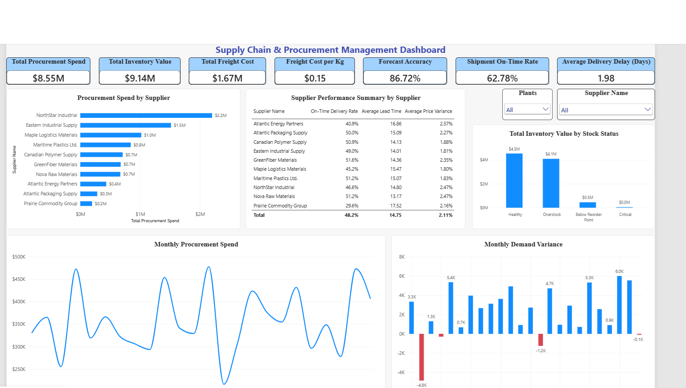
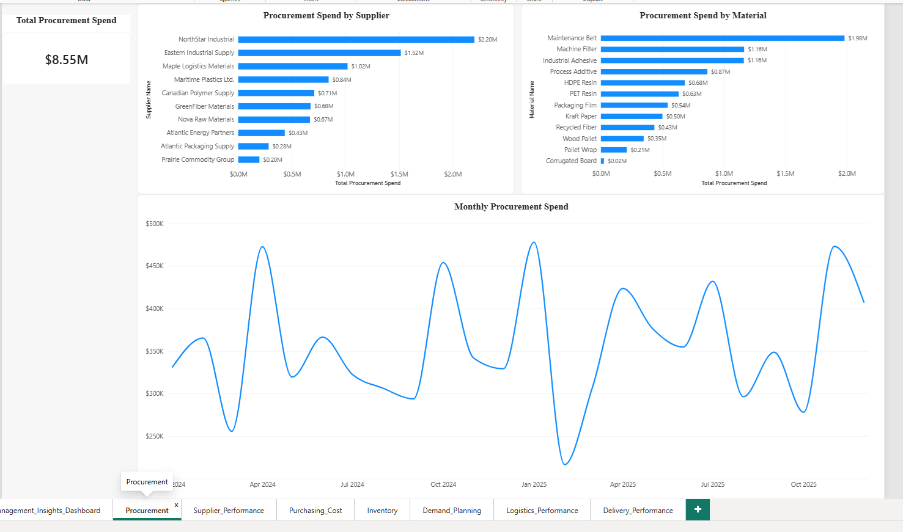
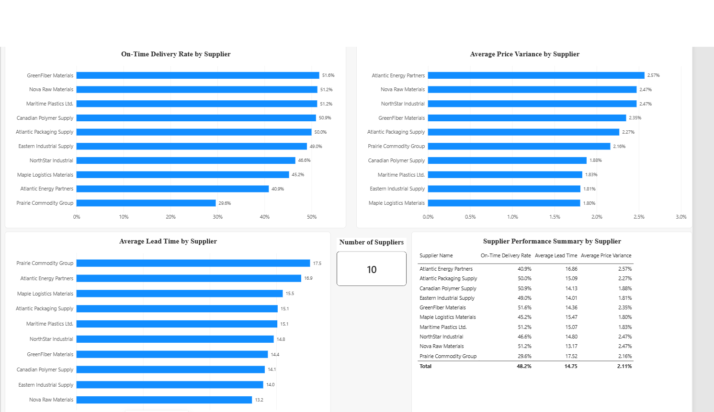
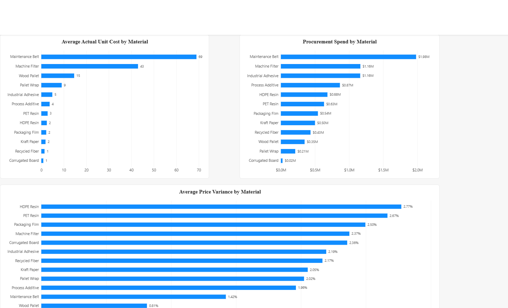
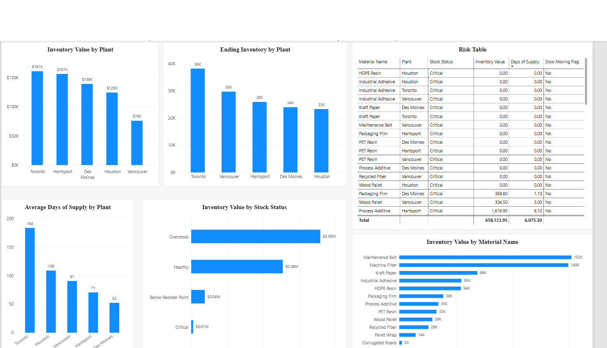
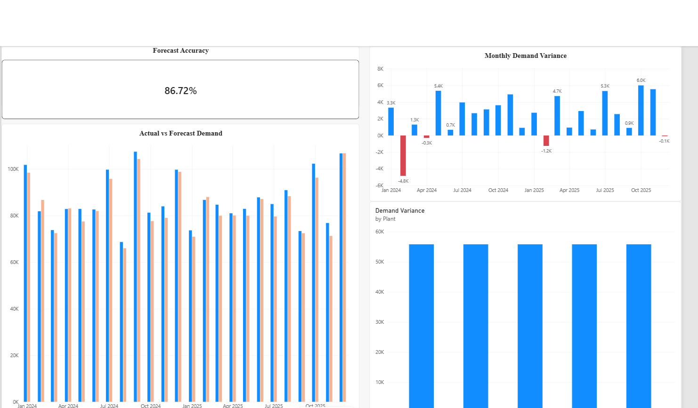
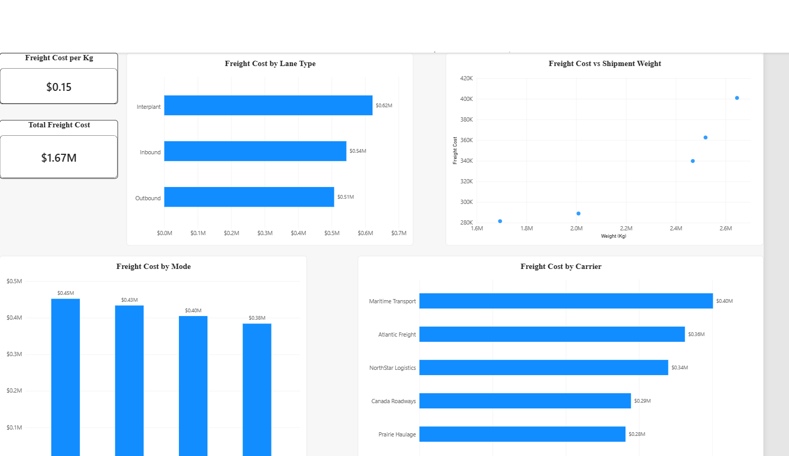
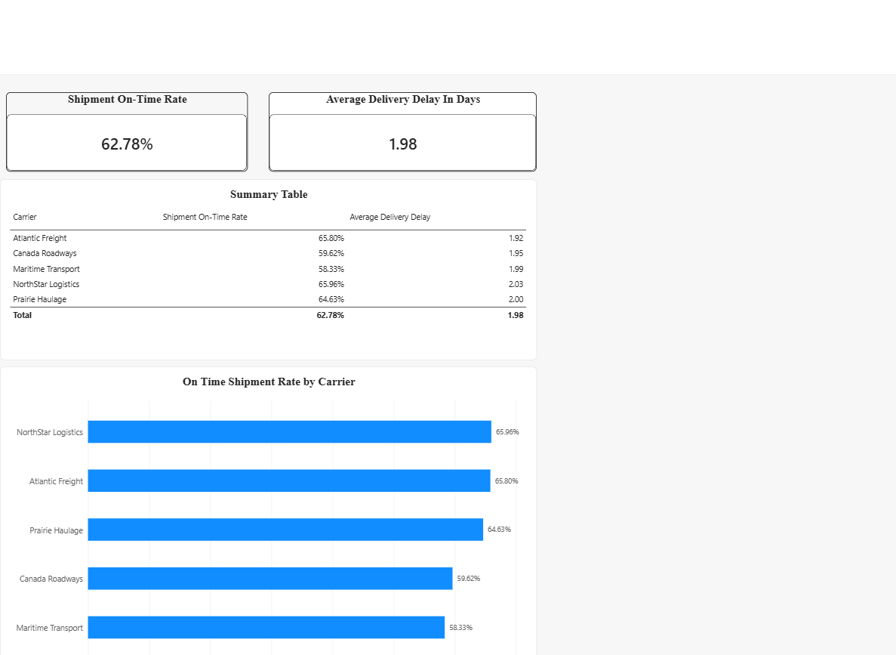

# Supply Chain & Procurement Analytics — Power BI

## Project Overview

This project analyzes **procurement, supplier performance, purchasing costs, inventory, demand planning, logistics, and delivery performance** using Power BI.

The goal was to build a management-focused dashboard that identifies **cost drivers, inventory risks, supplier issues, demand variances, and opportunities for supply-chain improvement**.

 **NOTE:** The dataset is synthetic and was created for portfolio/practice purposes. It is not CKF's actual company data.

---

## Business Questions

The analysis was designed to answer:

1. How much are we spending, and which suppliers/materials account for the largest share of procurement spend?
2. Which suppliers are performing well, and which require attention?
3. Where are we seeing significant differences between standard and actual purchase costs?
4. What is the current state and value of inventory?
5. Which materials are at risk because of low stock, excessive inventory, or slow movement?
6. How closely does actual demand match forecasts?
7. Where do inventory and demand patterns indicate potential supply-chain risks?
8. How much are we spending on freight, and which carriers, routes, or transportation methods require attention?
9. How effectively are shipments being delivered on time?
10. Where are the biggest opportunities to reduce cost and improve supply-chain performance?

---

## Tools & Skills

- **Excel** — Raw data storage and dataset structure
- **Power Query** — Data cleaning, validation, and transformation
- **Power BI** — Data modeling, visualization, and dashboard development
- **DAX** — KPIs, variance analysis, forecasting metrics, and performance calculations

### Key Analytical Areas

- Procurement spend analysis
- Supplier performance
- Purchase price variance
- Inventory health and risk
- Demand vs. forecast analysis
- Freight and logistics costs
- Delivery performance
- Management-level KPI reporting

---

##  Dashboard

The report contains **8 pages**:

1. **Procurement Performance**
2. **Supplier Performance**
3. **Purchasing Cost**
4. **Inventory Health & Risk**
5. **Demand Planning**
6. **Logistics Performance**
7. **Delivery Performance**
8. **Management Dashboard**

The final dashboard brings the most important findings together through procurement, inventory, forecasting, freight, supplier, and delivery KPIs.
## Dashboard Screenshots

### 1. Management Dashboard

### 2. Procurement Performance

### 3. Supplier Performance

### 4. Purchasing Cost

### 5. Inventory Health & Risk

### 6. Demand Planning

### 7. Logistics Performance

### 8. Delivery Performance

---

##  Key Findings

- Total procurement spend was approximately **$8.55M**.
- NorthStar Industrial accounted for the largest share of supplier procurement spend, while Maintenance Belt was the largest material by procurement spend.
- Prairie Commodity Group required attention due to its lower on-time performance and longer lead time.
- **HDPE Resin and PET Resin** showed the highest purchase-price variances.
- As of December 31, 2025, inventory value was highest in **Toronto and Hantsport**.
- Approximately **$4.10M**, or about **45% of inventory value**, was classified as overstock, representing a major opportunity for inventory optimization.
- Forecast accuracy was **86.72%**, with several periods showing significant demand variances.
- Total freight spending was approximately **$1.67M**, with Interplant shipments representing the largest freight-spend category.
- Overall shipment on-time performance was **62.78%**, with late shipments averaging **1.98 days** of delay.

---

##  Management Opportunities

The analysis highlights several potential improvement areas:

- Review high-spend suppliers and materials for procurement savings.
- Investigate materials with higher purchase-price variances.
- Reduce excess and slow-moving inventory while protecting critical stock levels.
- Improve forecasting in periods with significant demand variances.
- Review high freight-cost carriers, lanes, and transportation methods.
- Improve supplier and carrier delivery performance.

---

##  Project Files

- ### Supply_Chain_Procurement_Analytics.pbix` — Power BI report
- ### Supply_Chain_Procurement_Analytics.xlsx` — Source dataset
- ### Business_Questions_Answers.docx` — Business questions and analysis
- ### Dashboard screenshots — Report pages and final management dashboard

---

##  Project Objective

The focus of this project was not only on building visuals, but on using data to identify **business problems, quantify their impact, and translate findings into actionable management opportunities**.
